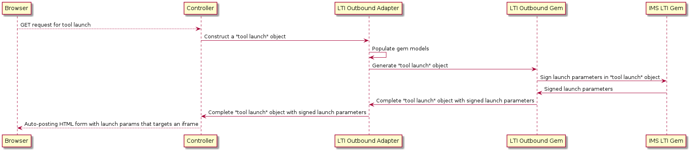

# Lti 1.1 Implementation

Canvas LTI 1.1 Implementation can be divided into three sections: tool installation, tool launches, and content item.

## Tool Installation
Tools are created via post requests to the `ExternalToolsController#create` action. Sometimes this is done by partners or customers making API requests directly. Sometimes this is done by using the UI Canvas provides.

The [Instructure API documentation](https://canvas.instructure.com/doc/api/external_tools.html) is a helpful resource to see what parameters may be used when creating a tool.

Tools are modeled using the ContextExternalTool class (context_external_tools table). This table has several columns to help keep track of the tool's context (account or course), privacy level (See [LTI 1.1 Launches](./05_lti_1_1_launches.md)), and configuration.

The `settings` column of the `context_external_tools` table is one of the most important data points. It contains a serialized representation of the tool's configuration.

Example `settings` column contents:
```ruby
{
  "url" => "https://wkd-lti-test.herokuapp.com/messages/blti"
  "selection_height" => 500,
  "selection_width" => 500,
  "text" => "Extension text",

  # Placement specific configuration
  "course_navigation" => {
        "canvas_icon_class" => "icon-lti",
                 "icon_url" => "https://wkd-lti-test.herokuapp.com/selector.png?course_navigation",
                     "text" => "course_navigation Text",
                      "url" => "https://wkd-lti-test.herokuapp.com/messages/blti"
    },
    "user_navigation" => {
        "canvas_icon_class" => "icon-lti",
                 "icon_url" => "https://wkd-lti-test.herokuapp.com/selector.png?user_navigation",
                     "text" => "user_navigation Text",
                      "url" => "https://wkd-lti-test.herokuapp.com/messages/blti"
    }
}
```

Data in the setting column is one of two types: top-level configuration or placement-level configuration.

In this example, the first key (`url`) is an example of a top-level configuration. Top-level configuration can usually be overridden by placement-specific configuration.

Placement-specific configuration is nested in a sub-hash with the placement name as the key. In the above configuration, the sub-hash identified by the `course_navigation` key is placement-specific. When Canvas launches an LTI tool, placement-specific configuration always trumps top-level configuration.

See the [LTI Overview](./01_lti_overview.md) for more information on placements.

The [External Tools Create API documentation](https://canvas.instructure.com/doc/api/external_tools.html#method.external_tools.create) does a good job enumerating possible keys and values the settings hash may contain.

Once a tool has been added to Canvas in the form of a `ContextExternalTool` record it can be launched.

Instructure-owned tools needing to bulk update settings on existing LTI 1.1 tools can use `BulkToolUpdater` in `instructure_misc_plugin`; talk to the Interop team.

## Tool Launches
For a conceptual overview of LTI 1.1 launches, see [LTI 1.1 Launches](doc/lti_manual/05_lti_1_1_launches.md)

LTI 1.1 launches use have five primary components in play:
- The user's browser
- Rails Controller Actions
- LTI Outbound Adapter / Related Factories
- LTI Outbound Gem
- IMS LTI Gem

Here is a very high-level overview showing the lifecycle of a launch and what components are used:


Next, we will go through each component that makes the LTI launch work in greater detail.

### 1. The User's Browser
LTI launches begin when a user clicks a link to some LTI tool in their browser. Their browser makes a GET request to one of the LTI launch controller actions.

### 2. Rails Controller Actions
A rails controller action handles the request made by the user's browser. For LTI 1.1, there are five controller actions used to trigger LTI launches:

**UsersController#external_tool**(`/app/controllers/users_controller.rb#external_tool`)

This action is only used for handling LTI launches that use the `user_navigation` placement.


**ApplicationController#content_tag_redirect**(`app/controllers/application_controller.rb#content_tag_redirect`)

This action is used to trigger LTI launches for two primary cases: "external tool" Assignment launches, and module item launches.

Both of these launches have one thing in common: a ContentTag record exists in Canvas that maps the assignment or module item to an external tool.

This action knows how to take a ContentTag pointing to an external tool and launch it.


**ExternalToolsController#show**(`app/controllers/external_tools_controller.rb#show`)

This is one of the most common actions that handle LTI launches. If the ID of the `ContextExternalTool` is known, this action will launch that tool.

This endpoint is used by any placement where the tool ID is known (`course_navigation`, `account_navigation`, etc.)


**ExternalToolsController#retrieve**(`app/controllers/external_tools_controller.rb#retrieve`)

This action is used when the exact `ContextExternalTool` ID is not known, but the launch URL to be used in the LTI launch is.

This scenario can occur when an LTI link is embedded in the RCE, for example.


**ExternalToolsController#generate_sessionless_launch**(`app/controllers/external_tools_controller.rb#generate_sessionless_launch`)

This particular action enables LTI launches in contexts that do not have an active Canvas web session. This is primarily used by the Canvas mobile apps.

To use an LTI 1.1 sessionless launch, a client first makes a request to the `generate_sessionless_launch` endpoint. This creates an LTI 1.1 launch in much the same way as the other actions (more details below).

Rather than rendering the LTI launch, however, this endpoint caches the LTI launch as a serialized Hash and returns a random "verifier" string to the client.

The client can then make a follow-up request to the `sessionless_launch` endpoint and provide that verifier, which will render the LTI launch.

**Action Summary**

While these actions differ in a few ways, they each perform similar steps do launch the LTI tool. Each of the above actions to the following:

**I. Lookup the correct ContextExternalTool record**.

In the `ExternalToolsController#show` action, this is as easy as `@context.context_external_tools.active.find(params[:external_tool_id])`.

Other actions, however, lookup the tool in different ways. The `ExternalToolsController#retrieve`action looks up the tool by URL and the `ApplicationController#content_tag_redirect` action looks up the tool by ContentTag.

**II. Construct an Lti::Launch instance**

Next, the action constructs an object that is used to model the LTI launch data. This model is not an active record model, it's just used to provide a common interface that describes an LTI launch.

The Launch model class is located at `app/models/lti/launch.rb`

This Launch model contains several important attributes like `params` (a hash of all parameters) and `launch_type`.

in the `ExternalToolsController#show` action, this model is initialized like this:
```ruby
# ExternalToolsController#basic_lti_launch_request
lti_launch = tool.settings['post_only'] ? Lti::Launch.new(post_only: true) : Lti::Launch.new
```
The model is now initialized but does not have much useful data in the `params` attribute. Next, the action will work to populate those parameters.

**III. Construct an Lti::VariableExpander instance**

LTI launches may include _custom variable expansions_ in the launch as parameters (See [Custom Parameters](./08_custom_parameters.md)).

To expand these custom variables, LTI controller actions use the `Lti::VariableExpander` (lib/lti/variable_expander.rb).

This class can take a hash of key/values and expand all the expandable values. Expandable values being with a `$`. For example, the variable expander could transform a hash like this: `{ course_id: '$Canvas.course.id' }` into `{ course_id: 23 }`.

The action constructs an instance of this variable expander class in order to expand custom variables. In the `ExternalToolsController#show` action, this happens like so:
```ruby
# ExternalToolsController#basic_lti_launch_request
expander = variable_expander(assignment: assignment,
      tool: tool, launch: lti_launch,
      post_message_token: opts[:launch_token],
      secure_params: params[:secure_params])
...

private

def variable_expander(opts = {})
  default_opts = {
    current_user: @current_user,
    current_pseudonym: @current_pseudonym,
    tool: @tool }
  Lti::VariableExpander.new(@domain_root_account, @context, self, default_opts.merge(opts))
end
```

As you can see from the above code, the variable expander's initializer requires contextual information to expand all possible variables.

**IV. Construct an Lti::LtiOutboundAdapter instance**

The action is getting closer to populating the `Lti::Launch` model's `params` attribute, but we need one more thing first.

Ultimately, the `lti_outbound` Ruby gem (located in `gems/lti_outbound`) is responsible for creating the hash we will use for the `params` attribute.

This Ruby gem's original intent was to create a reusable library that other tool consumers (besides Canvas) could use to easily do LTI launches. This intent was never fully realized, but it still provides a nice separation of concerns.

The `lti_outbound` gem models resources that are important to an LTI launch, then uses those models to generate a Hash representing the LTI launch parameters. This means we need some way to translate Canvas models (like User, Course, etc.) into `lti_outbound` models (like LtiUser, LtiContext, etc.).

The LTI controller actions use a class that serves as a translation layer between the Canvas models and the `lti_outbound` models: an _adapter_.

The LTI controller action constructs an instance of an Lti::LtiOutboundAdapter as the next step of getting the `Lti::Launch.params` populated.

In the `ExternalToolsController#show` action, this happens like so:
```ruby
adapter = Lti::LtiOutboundAdapter.new(tool, @current_user, @context).prepare_tool_launch(
  @return_url,
  expander,
  opts
)
```

We'll talk more about the `prepare_tool_launch` method getting called there later, but for now, just know it's constructing the `lti_outbound` models.

Next, the controller action uses some public methods from the adapter to construct the parameters. Let's see what the adapter is doing under the hood:

### 3. LTI Outbound Adapter & Related Factories
As noted above, all LTI launch controller actions construct an instance of the Lti::LtiOutboundAdapter class.

This adapter helps to map Canvas-side models (Course, Account, User, etc) to `lti_outbound` gem models (LtiContext, LtiUser, etc.). It then exercises the `lti_outbound` gem to generate the hash that will be used to populate the `params` attribute of the `Lti::Launch` mentioned in section II of the "Rails Controller Actions" section.

This adapter adheres to an "LTI Adapter" interface that is also implemented by another adapter described in the LTI 1.3 Implementation docs. The public methods of that "LTI Adapter" interface are:
- generate_post_payload
- generate_post_payload_for_assignment
- generate_post_payload_for_homework_submission
- launch_url

Note that there is no code that actually enforced adherence to this interface. Currently there are two classes that adhere to this interface, however. One for LTI 1.1 (`Lti::LtiOutboundAdapter`) and one for LTI 1.3 (`Lti::LtiAdvantageAdapter`). Future versions of LTI may be implemented by introducing a new adapter.

The LTI controller action will choose _one_ of the `generate_post_payload*` methods, depending on the placement of the launch. These `generate_post_payload*` methods return a hash of LTI launch parameters that will finally be used for the `Lti::Launch.params` attribute and ultimately sent in the LTI launch post request.

An example of an LTI controller action choosing one of these methods can be seen in the `ExternalToolsController#show` action:

```ruby
# ExternalToolsController#basic_lti_launch_request
...
lti_launch.params = if selection_type == 'homework_submission' && assignment && !tool.use_1_3?
    adapter.generate_post_payload_for_homework_submission(assignment)
  elsif selection_type == "student_context_card" && params[:student_id]
    student = api_find(User, params[:student_id])
    can_launch = tool.visible_with_permission_check?(selection_type, @current_user, @context, session) &&
      @context.user_has_been_student?(student)
    raise Lti::Errors::UnauthorizedError unless can_launch
    adapter.generate_post_payload(student_id: student.global_id)
  elsif tool.extension_setting(selection_type, 'required_permissions')
    can_launch = tool.visible_with_permission_check?(selection_type, @current_user, @context, session)
    raise Lti::Errors::UnauthorizedError unless can_launch
    adapter.generate_post_payload
  else
    adapter.generate_post_payload
  end
...
```

Before any of the `generate_post_payload*` methods can be called, however, the `prepare_tool_launch` method must be invoked. It's essentially an initializer that sets up the adapter for servicing the `generate_post_payload*` methods (in fact, I personally think we can have the _actual_ initializer just call this method).

Let's break down what these methods do:
**I. LtiOutboundAdapter#prepare_tool_launch**
As described above, this method helps prepare the adapter for servicing calls to the `generate_post_payload*` methods.

This method simply initializes the `lti_outbound` models by making calls to various factories.

As a reminder, the `lti_outbound` internal gem is ultimately responsible for generating the hash of LTI parameters.

The `lti_outbound` models initialized in this method are:

**LtiOutbound::LtiContext**
```ruby
# Lti::LtiOutboundAdapter#prepare_tool_launch
...
lti_context = Lti::LtiContextCreator.new(@context, @tool).convert
```

**LtiOutbound::LtiUser**
```ruby
# Lti::LtiOutboundAdapter#prepare_tool_launch
...
lti_user = Lti::LtiUserCreator.new(@user, @root_account, @tool, @context).convert if @user
```

**LtiOutbound::LtiTool**
```ruby
# Lti::LtiOutboundAdapter#prepare_tool_launch
...
lti_tool = Lti::LtiToolCreator.new(@tool).convert
```

**LtiOutbound::LtiAccount**
```ruby
# Lti::LtiOutboundAdapter#prepare_tool_launch
...
lti_account = Lti::LtiAccountCreator.new(@context, @tool).convert
```

and

**LtiOutbound::ToolLaunch**
```ruby
# Lti::LtiOutboundAdapter#prepare_tool_launch
...
@tool_launch = LtiOutbound::ToolLaunch.new(
  {
    ...
    context: lti_context,
    user: lti_user,
    tool: lti_tool,
    account: lti_account,
    variable_expander: variable_expander
  }
)
```

As can bee seen, the lti-context, lti_user, lti_tool, and lti_account models are used to create an instance of `LtiOutbound::ToolLaunch`, which will be used to generate the launch parameters in the generate_post_payload_for*` methods.

**II. LtiOutboundAdapter#generate_post_payload**

One of the public methods required by the "LTI Adapter" interface mentioned in "*IV. Construct an Lti::LtiOutboundAdapter instance*"

This method ultimately generates the "default" LTI launch payload. It returns the LTI launch parameters, including OAuth parameters, as a hash.

As noted above, the `#prepare_tool_launch` method previously created an instance of `LtiOutbound::ToolLaunch` and set it to a variable named `@tool_launch`. The first thing `#generate_post_payload` does is call `generate` on `@tool_launch`.

This generates a hash of all the default LTI parameters.

`#generate_post_payload` then uses ` Lti::Security.signed_post_params` to generate the OAuth parameters for the LTI parameters hash.

The OAuth parameters and the default LTI parameters are merged and returned.

**III. LtiOutboundAdapter#generate_post_payload_for_assignment**

One of the public methods required by the "LTI Adapter" interface mentioned in "*IV. Construct an Lti::LtiOutboundAdapter instance*"

Serves the same purpose as `#generate_post_payload`, but adds additional parameters related to Canvas assignments to the LTI parameters hash.

This method is used to generate the LTI 1.1 launches that occur when an "External Tool Assignment" is launched in Canvas.

**IV. LtiOutboundAdapter#generate_post_payload_for_homework_submission**

One of the public methods required by the "LTI Adapter" interface mentioned in "*IV. Construct an Lti::LtiOutboundAdapter instance*"

Serves the same purpose as `#generate_post_payload`, but adds additional parameters related to Canvas submissions to the LTI parameters hash.

This method is used to generate the LTI 1.1 launches that occur in SpeedGrader and the submission details view.

**V. LtiOutboundAdapter#launch_url**

One of the public methods required by the "LTI Adapter" interface mentioned in "*IV. Construct an Lti::LtiOutboundAdapter instance*"

Returns the URL that the LTI launch should be made to.

After one of the these `*generate_post_payload` methods constructs the LTI parameters, those parameters are used in a Rails view to generate an HTML form that launches the tool. See section 6 for more details.

### 4. LTI Outbound Gem
The LTI Outbound Gem is a library used to model objects required to build an LTI launch. For example, the gem can model courses, roles, users, etc.

This gem was initially intended to be released publicly, but the need never arose.

The `Lti::LtiOutboundAdapter` (described in Section 3) is used to convert Canvas models (like `Course`) into LTI Outbound models (like `LTIOutbound::LTICourse`).

The models themselves are self-explanatory.

One model of special significance is the `LtiOutBound::ToolLaunch` located at `gems/lti_outbound/lib/lti_outbound/tool_launch.rb` This model is the class that generates the LTI 1.1 launch parameters as a hash (more details in Section 3).

This layer of abstraction between Canvas models and the LTI 1.1 launch was originally intended to allow other Instructure or external systems to become LTI tool consumers. This vision was never realized, however.
### 5.IMS LTI Gem
The IMS LTI Gem can be found [here](https://github.com/instructure/ims-lti).

This gem provides helpers useful to both LTI tool consumers and tool providers. For example: helper methods to generate OAuth parameters for launches and helpers to validate LTI launches.

During an LTI 1.1 launch, this gem is used by the `Lti::LtiOutboundAdapter` (described in section 3) to generate the OAuth parameters needed for an LTI launch. This call to the IMS LTI gem is wrapped in the `Lti::Security` module.

See `Lti::Security.signed_post_params_frd`.
### 6. Self-submitting HTML form
After LTI launch parameters have been generated using the `Lti::LtiOutboundAdapter` described in section 3, the controller uses the `Lti::AppUtil.Lti::AppUtil.display_template` method to determine what view should be used to show the launch.

Options are:
- borderless (no Canvas UI is shown)
- full_width (The Canvas global navigation is shown)
- in_context (default - The Canvas global and context navigations are shown)
- full_width_in_context (The Canvas global and context navigations are shown, but the tool's iframe takes all remaining space).
- in_nav_context (The Canvas global and context navigations are shown, but other contextual info like assignment details are hidden. The tools' iframe takes up all remaining space).

Which view is selected is determined by the `display_type` top-level or placement-level tool configuration.

Each ultimately uses the `lti/lti_message' partial view. This view renders a form with one hidden input tag per LTI launch parameter. The form's action is the LTI launch url (determined from the adapter in section 3).

Importantly, this form targets an iframe also rendered in this view (#tool_content).

The form is auto-submitted, which sends all LTI parameters to the tool's launch URL within the iframe.
